# Dockerised Botkit bootstrap
This repo houses a very basic bootstrap project to create a Slack or Facebook bot/app using Botkit.

To get you started, this bot implements a couple of basic interactions, which you can use to get started writing your own functionality. If you message the bot directly (using a private message, or by mentioning the bot's name in a channel where it resides) with the word _ping_, it will respond with _pong_. Additionally, for any channel the bot is invited to, it will listen to all messages in that channel, logging them out to the console. For Facebook bots, it will respond directly to 'hello'.

For more information on how to integrate your bot, see the [Botkit documentation for Slack](https://github.com/howdyai/botkit/blob/master/readme-slack.md), or the [Botkit documentation for Facebook](https://github.com/howdyai/botkit/blob/master/readme-facebook.md).

## Creating a Slack bot using a 'Custom Integration'
This is the simplest and quickest way of adding a Bot to your Slack team. The first thing you will need to do is create a custom integration bot configuration, which you will then use to allow your code to connect to the Slack RTM (Real Time Messaging) API. 

### Configure a bot
First, visit the [Slack apps index](https://innovation-dwp.slack.com/apps).

Search for bots and select 'Bots - connect a bot to the slack Real Time Messaging API'

<p align="center">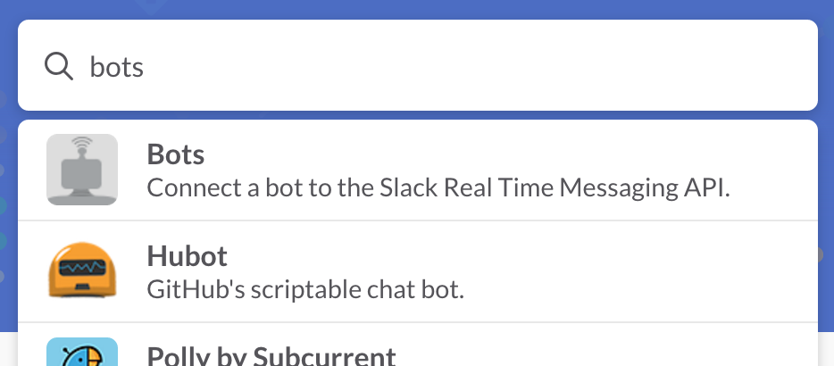</p>

Select 'Add configuration' and give your bot a name.

<p align="center">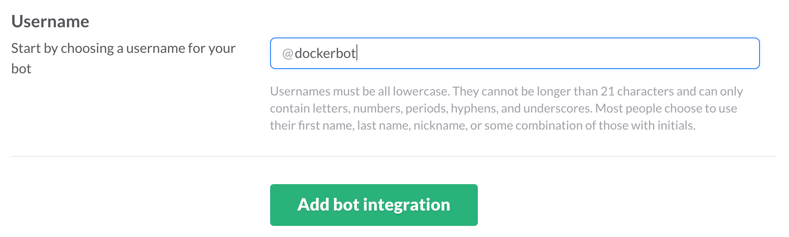</p>

You should now see the configuration screen for the bot. Take note of the API token and save the configuration.

<p align="center">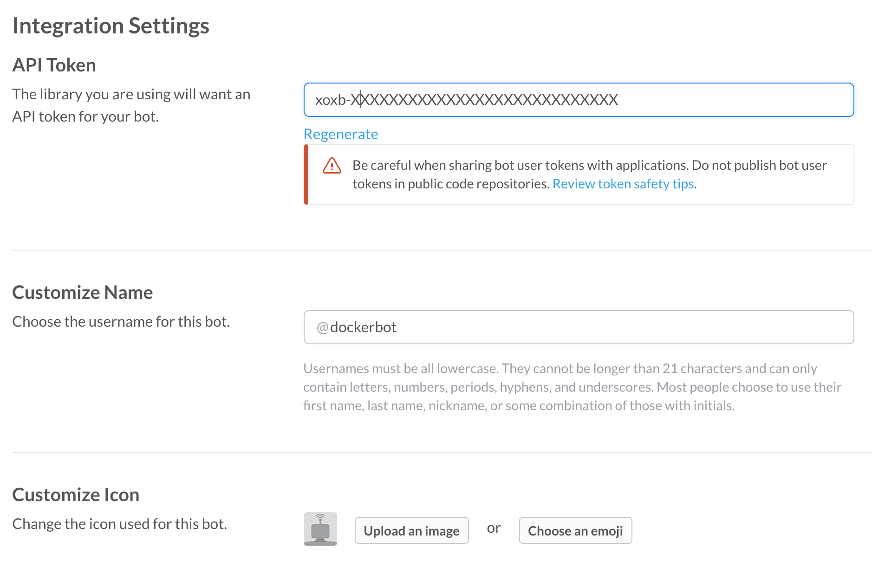</p>

### Checkout the code
Now clone this repository, and edit the `.env` file to add the token to the `TOKEN` environment variable. You should also set the `BOT_PLATFORM` variable to 'slack_ci'. You can edit the code later - let's just get the bot connected first to demonstrate it working. Assuming you're not running on a Linux machine, you will want to make sure docker-machine and docker are installed, and that you have a running virtual machine. A Docker Compose configuration file has also been provided to make it easier to create the bot. If running on a Mac, you can install the necessary packages with homebrew, and setup a VM:

```bash
brew install docker-machine docker docker-compose
docker-machine create --driver virtualbox bot
eval $(docker-machine env bot)
```

Next, just run the bot using Docker Compose, which should build and run the images for you.

```bash
docker-compose up
```

### Speak to your bot
If you now return to your Slack team and open a private message with your bot, you should see that it appears online and will respond if you send it a 'ping' message.

<p align="center">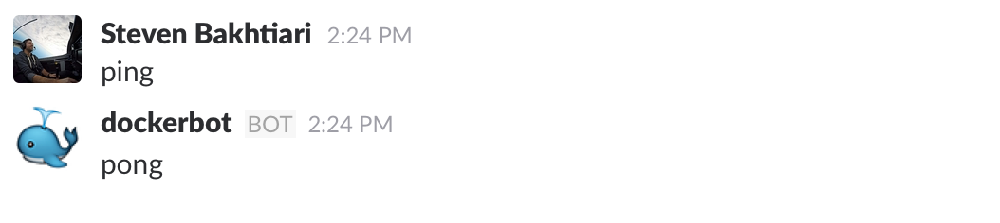</p>

## Creating a deployable Slack app to be used by multiple teams
If you want to create a bot that can be used by multiple teams, it will need to be packaged up as a Slack app. The setup process is a little more involved, but the code will not need to be modified. 

### Create an app
The first thing you will need to do, is to create an app by visiting the ['Your Apps' page](https://api.slack.com/apps) on the Slack API site. Once there, click on the 'Create New App' button and complete all relevant details (name, team, etc). Note, do not set the Redirect URL yet; this template project uses the localtunnel service to create a temporary domain name pointing to the container running on your development machine, and you will obtain the domain when running the app.

<p align="center">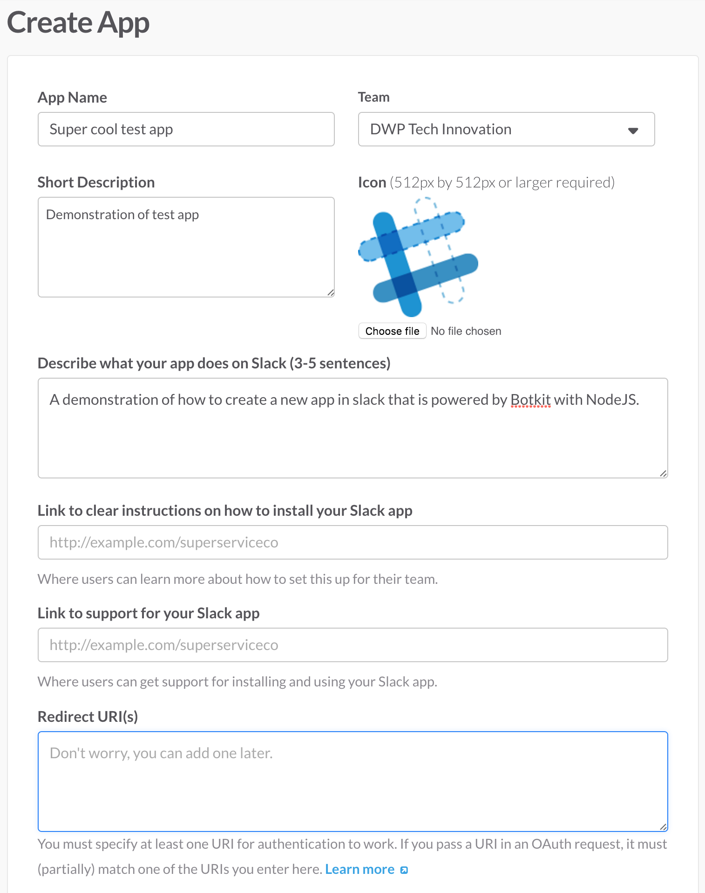</p>

Once saved, navigate to the 'App Credentials' page using the navigation menu on the left. Take note of the Client ID and Client Secret.

<p align="center">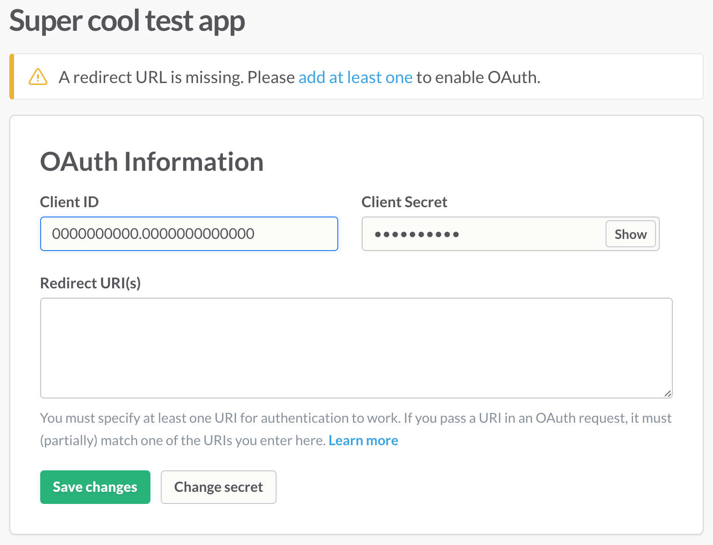</p>

Next, navigate to the 'Bot Users' page using the same navigation menu, and add a bot user to your app.

<p align="center">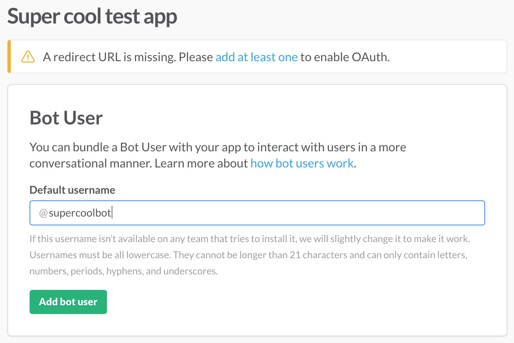</p>

### Checkout the code
Now you can clone this repository, editing the `.env` file to set the `CLIENT_ID` and `CLIENT_SECRET` environment variables. Also assign the `BOT_PLATFORM` variable a value of 'slack_app'. Assuming you're not running on a Linux machine, you will want to make sure docker-machine and docker are installed, and that you have a running virtual machine. A Docker Compose configuration file has also been provided to make it easier to create the bot. If running on a Mac, you can install the necessary packages with homebrew, and setup a VM:

```bash
brew install docker-machine docker docker-compose
docker-machine create --driver virtualbox bot
eval $(docker-machine env bot)
```

You should now be able to run the bot using Docker Compose, which will build and run the images for you.

```bash
docker-compose up
```

Note, the output from running `docker-compose up` will contain a URL that can be used to access your app. The use of the localtunnel service here should only be used in this demonstration app. In a production environment, you will want to configure your own domains!

<p align="center">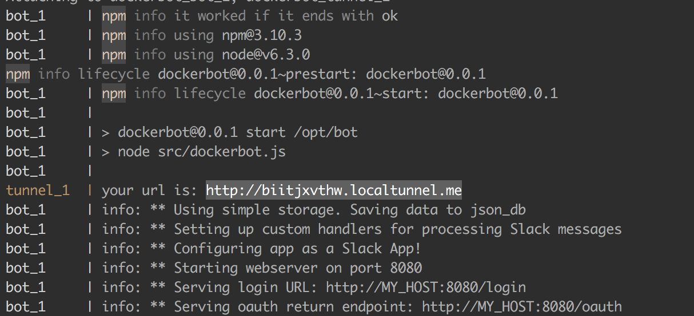</p>

Taking this URL, navigate back to the 'App Credentials' page and append `/oauth` to it, setting it as the Redirect URL.

<p align="center">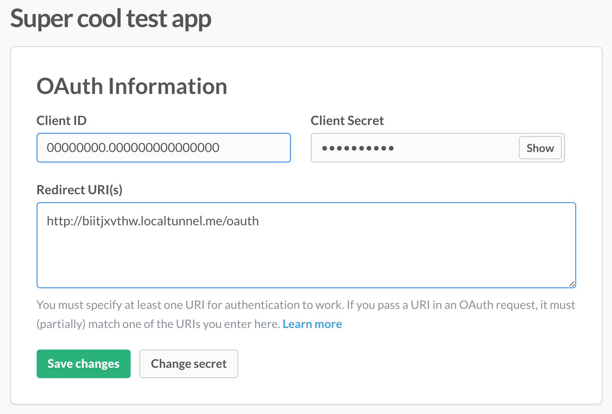</p>

Finally, in your browser, access the URL, with /login appended. This will load your app, which will then redirect you to Slack's auth screen. Select the relevant team to join and then authorise the app to connect.

### Speak to your app/bot
If you now return to your Slack team and open a private message with the bot you added to the app in the previous steps, you should see that it appears online and will respond if you send it a 'ping' message. You can also invite the bot into a channel and interact with it. 

<p align="center">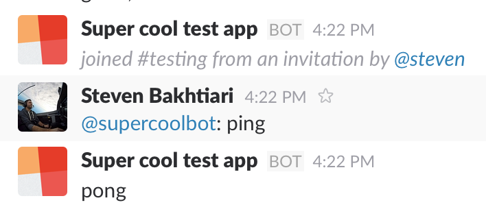</p>

## Creating a Facebook bot
It's possible to create a bot which can hook into Facebook's messenger platform and respond directly to messages. Creating a Facebook bot is quite an involved process, but the template app should abstract away some of the pain.

### Create a Facebook app
To get started, go to the page to [create a Facebook app](https://developers.facebook.com/quickstarts/), and select 'WWW'. If your Facebook account is not already registered as a developer, you will need to do this first.

<p align="center">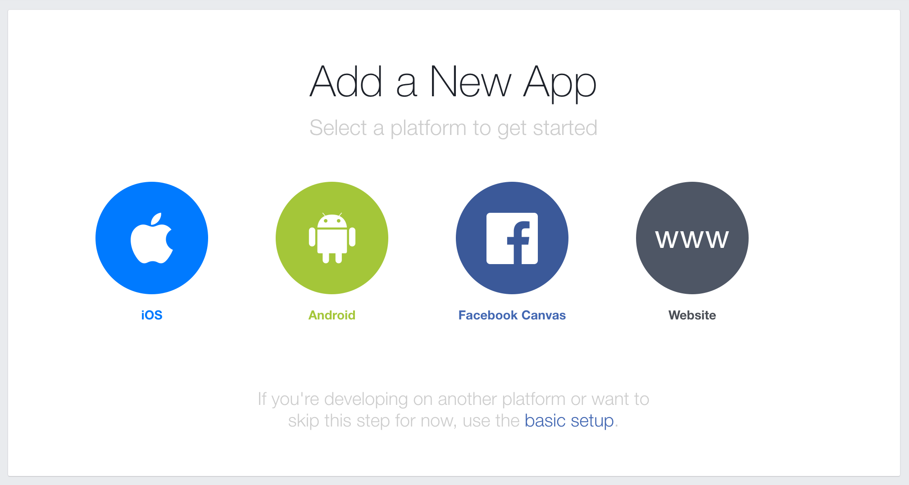</p> 

Now select a name for your application.

<p align="center">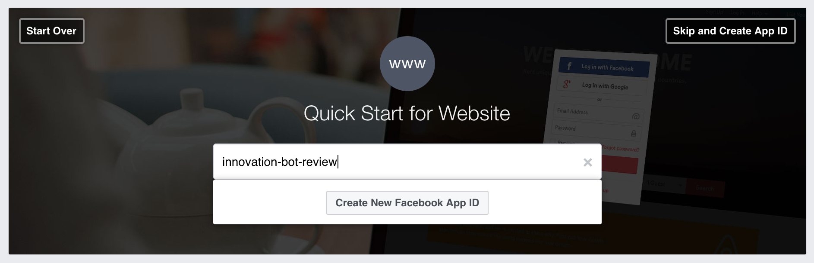</p>

Provide an email address and select 'App for pages' in the category select box. Provide a valid URL when asked (this is unimportant).

<p align="center">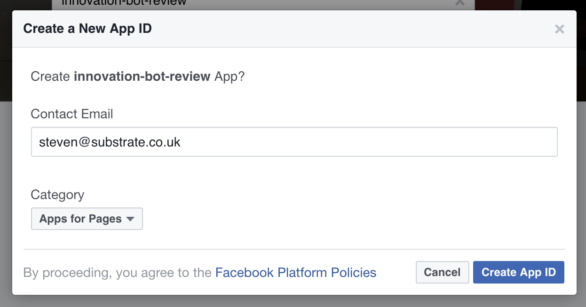</p>

### Create a Facebook page
Next, create a page and give it a name and a custom path. You can leave all other settings unchanged and skip them.

<p align="center">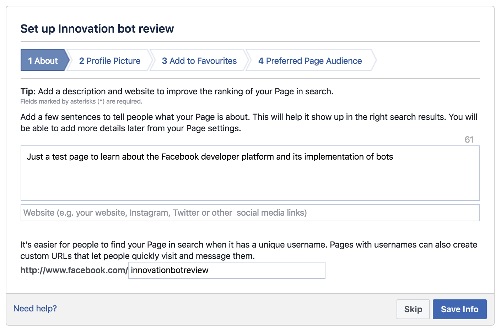</p>

### Configure access to the Messenger platform
Go to the Developer Dashboard for your new app, and from the left hand menu, select 'Add product' and then choose 'Messenger' from the options. The following page will have a few sections. First, under the Token Generation, select the page that you created previously. It will auth before presenting you with the token. Take note of that token.

<p align="center">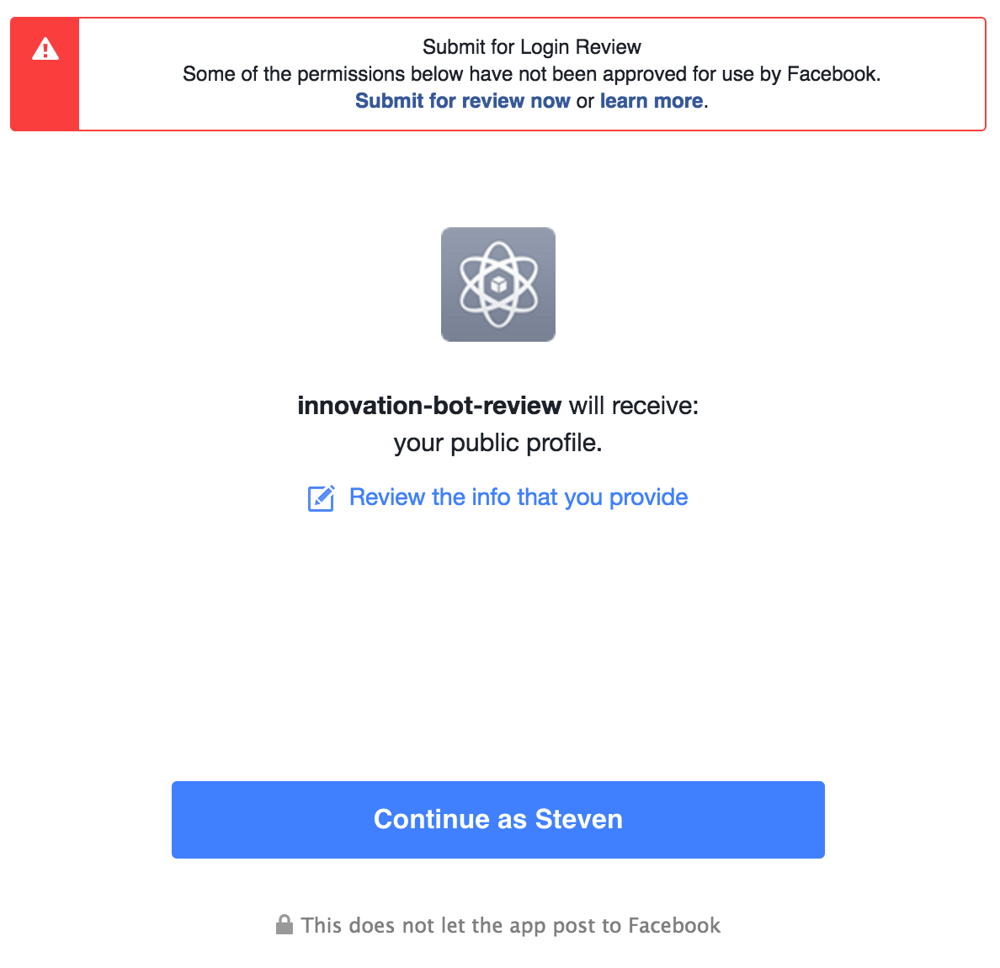</p>

<p align="center">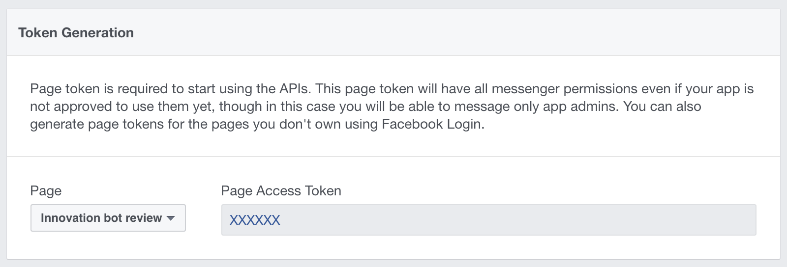</p>

### Checkout the code
Clone this repository and edit the `.env` file, assigning the token just obtained to the `PAGE_TOKEN` environment variable. You should also set the `VERIFY_TOKEN` to a random value of your choice. Finally, set the `BOT_PLATFORM` variable to 'facebook_app'. Assuming you're not running on a Linux machine, you will want to make sure docker-machine and docker are installed, and that you have a running virtual machine. A Docker Compose configuration file has also been provided to make it easier to create the bot. If running on a Mac, you can install the necessary packages with homebrew, and setup a VM:

```bash
brew install docker-machine docker docker-compose
docker-machine create --driver virtualbox bot
eval $(docker-machine env bot)
```

You should now be able to run the bot using Docker Compose, which will build and run the images for you.

```bash
docker-compose up
```

Note, the output from running `docker-compose up` will contain a URL that can be used to access your app. The use of the localtunnel service here should only be used in this demonstration app. In a production environment, you will want to configure your own domains!

<p align="center"></p>

### Back to configuring access to the Messenger platform
Return to the Developer Dashboard and navigate to the Messenger platform settings you already started configuring. Under the Webhooks section, select 'Setup webhooks'. In this dialogue, select the 'messages' checkbox and enter your custom defined verification token that you set in the `.env` file. Also add the URL taken from the previous step, but importantly, you need to change it from http to http*s* (as Facebook requires a secure connection). You must also append `/facebook/receive` to the URL. Select 'Verify and save'. You should see the verification message in the output logs of the bot in your terminal and the dashboard should show verification complete. Now under the same webhooks section, subscribe your webhooks to the page you previously created.

<p align="center">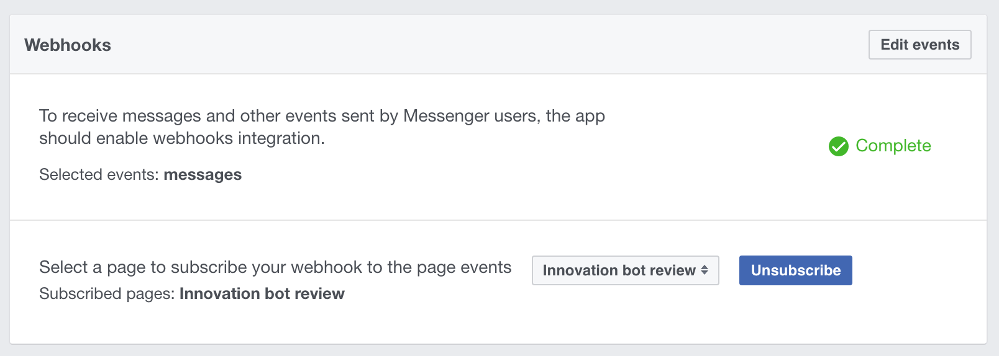</p>

### Speak to your bot
You will now be able to navigate to the Facebook page and send a message to your bot. *Note: when doing this, I found that the bot would not be notified of any messages from the Facebook page until around 10+ minutes had passed. There seems to be some delay in provisioning the service, possibly for security, or resource reasons. Once the first messages are received, subsequently messages are received immediately.

<p align="center">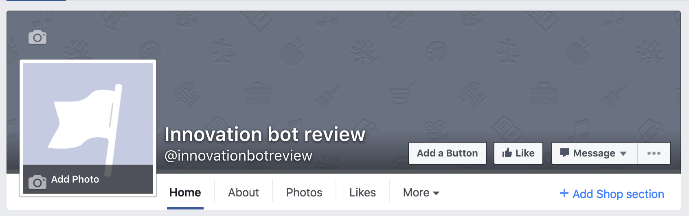</p>

<p align="center">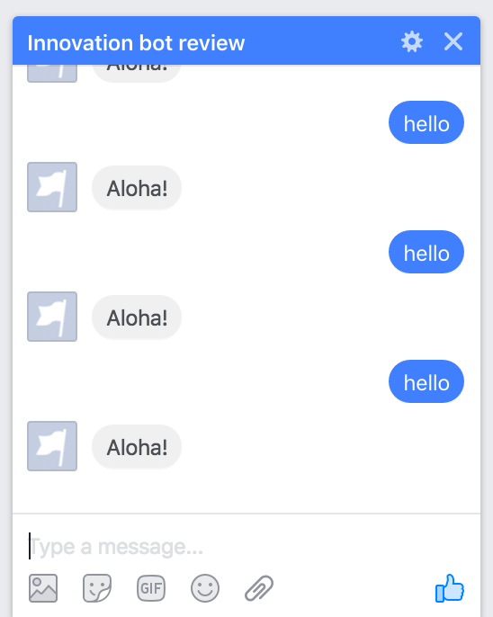</p>


